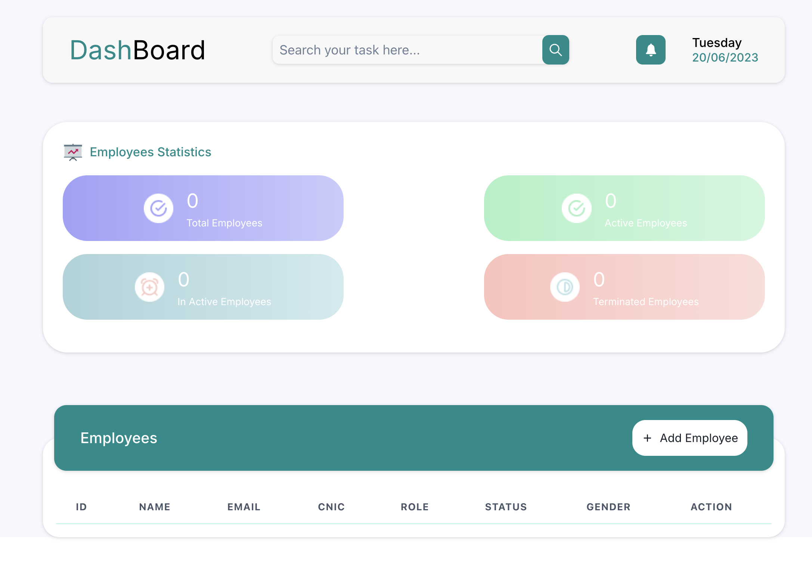
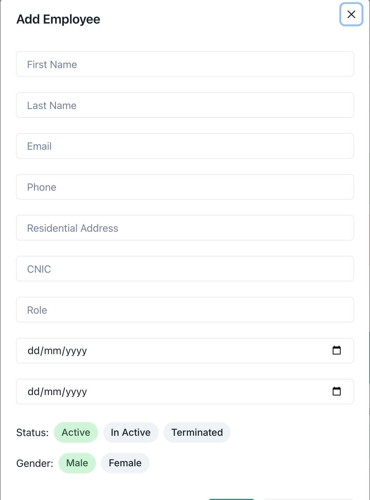
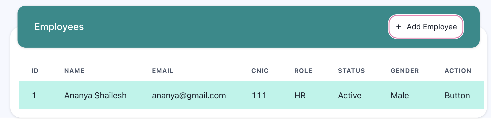
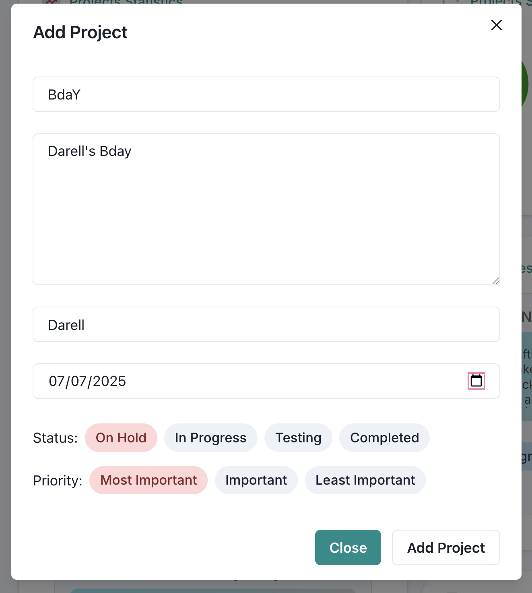
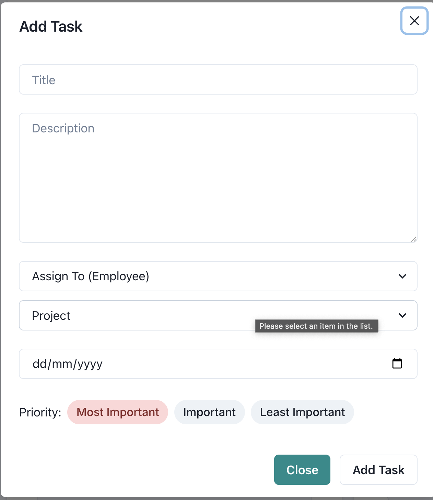
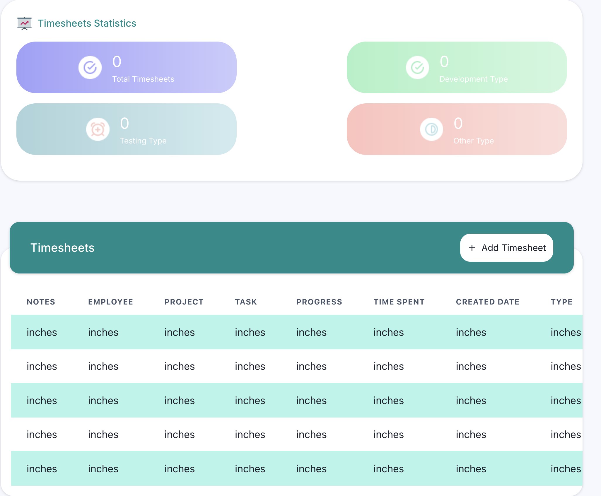
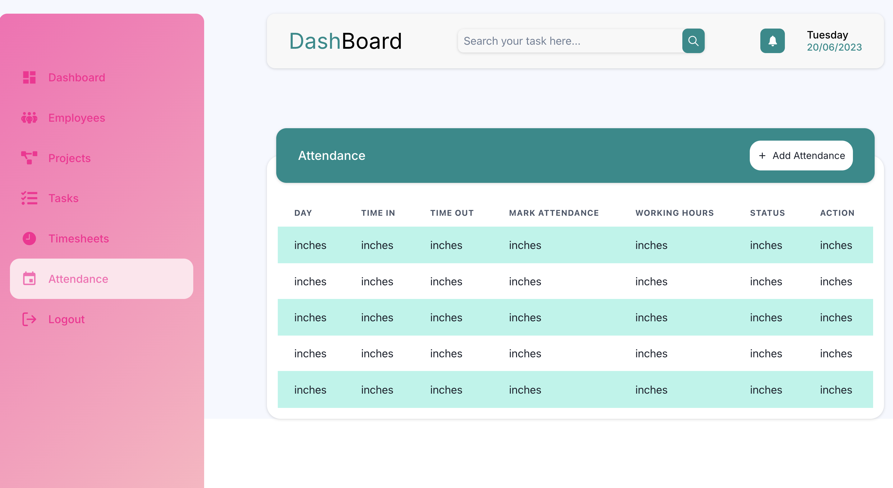

In the root directory of project, you can run this commands on terminal:
### `cd /frontend`
### `npm install`
### `npm start`

In the root directory of project, you can run this commands on terminal:
### `cd /backend`
### `node app.js`

## Technologies
***
A list of technologies used within the project:
* node v16.16.0
* npm v8.11.0
* reactjs + Material_UI for UI 
* mongodb for database

## Screenshots

