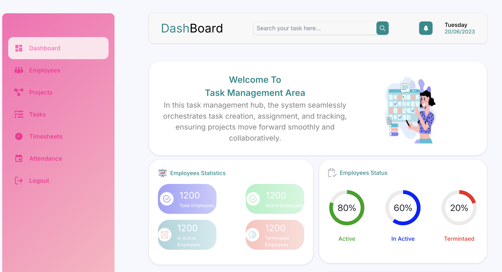
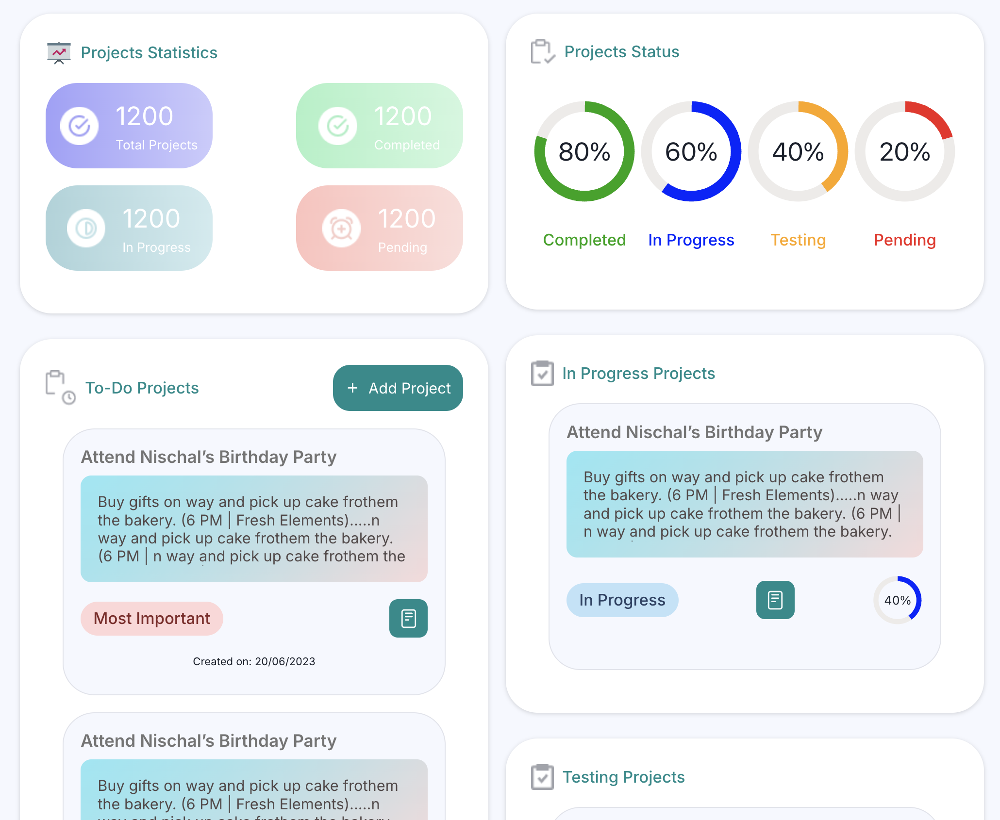
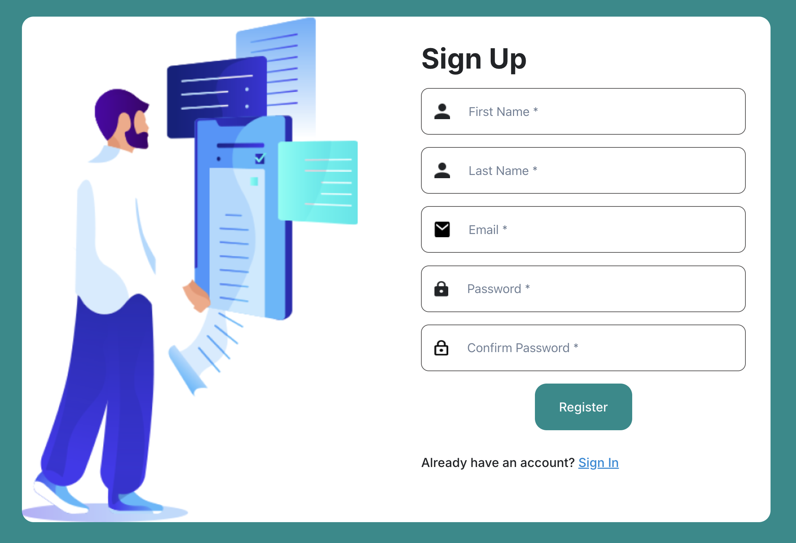

# Task Management System

A full-stack MERN (MongoDB, Express, React, Node.js) task management application with comprehensive features for managing employees, projects, tasks, timesheets, and attendance.

## 🚀 Features

- **Dashboard**: Real-time statistics and overview of all activities
- **Employee Management**: Add, view, and manage employee information
- **Project Management**: Track projects with different statuses (On Hold, In Progress, Testing, Completed)
- **Task Management**: Assign and track tasks with priorities and statuses
- **Timesheet Tracking**: Log work hours and track time spent on tasks
- **Attendance System**: Monitor employee attendance and working hours
- **Search Functionality**: Real-time search across all modules
- **Authentication**: Secure JWT-based login and registration
- **Responsive Design**: Works on desktop and mobile devices

## 📋 Prerequisites

- Node.js v16.16.0 or higher
- npm v8.11.0 or higher
- MongoDB (local or Atlas)

## 🛠️ Local Development Setup

### Backend Setup

1. Navigate to the backend directory:
```bash
cd backend
```

2. Install dependencies:
```bash
npm install
```

3. Create a `.env` file with the following variables:
```env
PORT=8000
MONGODB_URI=mongodb://0.0.0.0:27017/task-management
JWT_SECRET_KEY=your_secret_key_here
```

4. Start the backend server:
```bash
npm start
```
or for development with auto-reload:
```bash
npm run dev
```

The backend will run on `http://localhost:8000`

### Frontend Setup

1. Navigate to the frontend directory:
```bash
cd frontend
```

2. Install dependencies:
```bash
npm install
```

3. Create a `.env` file with:
```env
REACT_APP_API_URL=http://localhost:8000
```

4. Start the frontend development server:
```bash
npm start
```

The frontend will run on `http://localhost:3000`

## 🌐 Deployment

For detailed deployment instructions to production, see [DEPLOYMENT.md](./DEPLOYMENT.md)

### Quick Deployment Steps:

1. **Database**: Set up MongoDB Atlas (free tier)
2. **Backend**: Deploy to Render
3. **Frontend**: Deploy to Vercel

See the full deployment guide for step-by-step instructions.

## 🏗️ Technologies

**Backend:**
- Node.js & Express.js
- MongoDB & Mongoose
- JWT Authentication
- bcrypt for password hashing
- CORS & Body Parser

**Frontend:**
- React.js 18.x
- Chakra UI
- React Router v6
- Axios
- Framer Motion
- React Icons

## 📁 Project Structure

```
project_management_tool/
├── backend/
│   ├── config/          # Database configuration
│   ├── middleware/      # Authentication middleware
│   ├── models/          # Mongoose models
│   ├── routes/          # API routes
│   └── app.js           # Express app entry point
│
├── frontend/
│   ├── public/          # Static files
│   └── src/
│       ├── assets/      # Images and icons
│       ├── components/  # Reusable components (Navbar, Sidenav)
│       ├── config/      # Axios configuration
│       └── layouts/     # Page components
│
└── DEPLOYMENT.md        # Deployment guide
```

## 🔒 Authentication

The application uses JWT (JSON Web Tokens) for authentication:
- Register new users with email and password
- Login to receive a JWT token
- Token is stored in localStorage
- Protected routes require valid token

## 📊 API Endpoints

### Authentication
- `POST /api/register` - Register new user
- `POST /api/login` - User login

### Dashboard
- `GET /api/dashboard` - Get dashboard statistics

### Employees
- `GET /api/employees` - Get all employees
- `POST /api/employees` - Create employee
- `GET /api/employees-stats` - Get employee statistics

### Projects
- `GET /api/projects` - Get all projects
- `POST /api/projects` - Create project
- `GET /api/projects-stats` - Get project statistics

### Tasks
- `GET /api/tasks` - Get all tasks
- `POST /api/tasks` - Create task
- `GET /api/tasks-stats` - Get task statistics

### Timesheets
- `GET /api/timesheets` - Get all timesheets
- `POST /api/timesheets` - Create timesheet
- `GET /api/timesheets-stats` - Get timesheet statistics

### Attendance
- `GET /api/attendances` - Get all attendance records
- `POST /api/attendances` - Create attendance record

## 🎨 Screenshots










